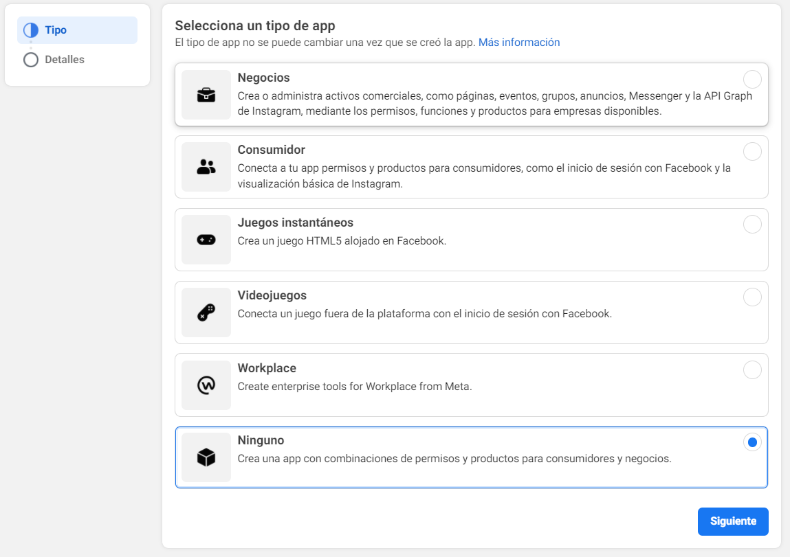
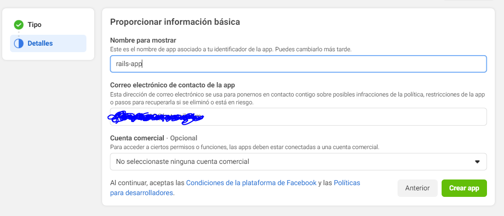
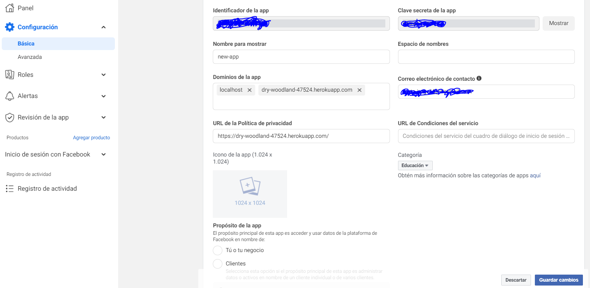
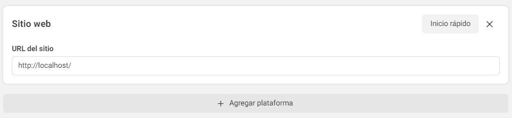
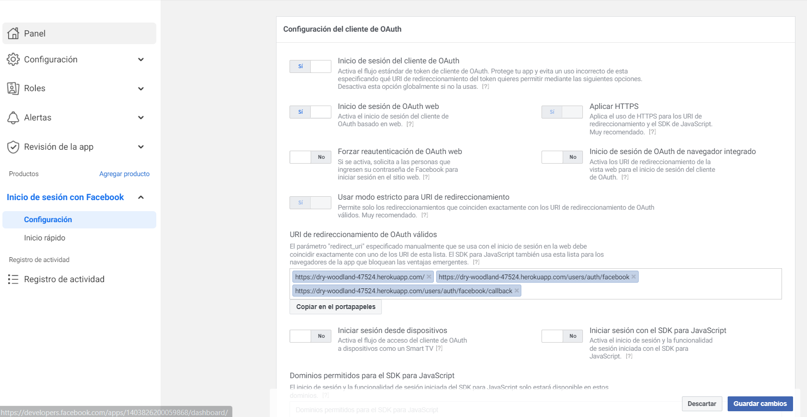
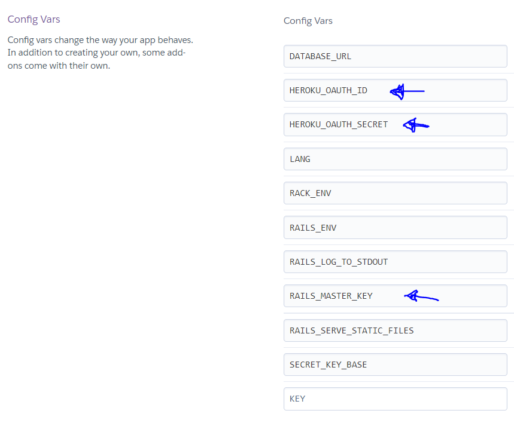

# Omniauth Facebook Authentication.

Ruby on Rail app. Users can sign up using their google accounts.

## Sumarize.

In this project, you will find all the configuration in order
to allow users sign up using their own facebook accounts.
Besides, you will learn how to configure your app to deploy it
to heroku.

## Software.

* Ruby 3.0.1
* Rails 6.1.4.7
* Windows 10
* VS Code.
* PostreSQL.
* Heroku.

## Process.

All the steps you will find in the sections below.

### Step 1. Gemfile and create Heroku app.

Add the next gems into your gemfile.rb

* gem 'devise'
* gem 'omniauth-facebook'
* gem 'omniauth'
* gem 'omniauth-rails_csrf_protection'
* gem 'omniauth-google-oauth2'
* gem 'pg' <- **Production group**
* gem 'sqlite' <- **Development group**

1. Run the command: `bundle install --without production`
2. Create heroku app: `heroku create`
3. Make a commit and deployed the app to heroku: `git push heroku master`

### Step 2. Adding devise user model and pages controller.

Type the next commands in the command prompt.

1. Generate pages controller: `rails g controller pages home`
2. Install devise: `rails g devise:install`
3. Add notice and alert messages.
4. Generate User model: `rails g devise User`
5. Generate devise views: `rails g devise:views`
6. Run rails migrate: `rails db:migrate`
7. Add the links in order to navigate to the sign un and aign in pages.

### Step 3. Configure routes.

Add the nex code in your routes.rb

```
Rails.application.routes.draw do
  devise_for :users, controllers: { omniauth_callbacks: 'users/omniauth_callbacks' }
  root 'pages#home'
end
```

### Step 4. Create Facebook app.

1. Go to https://developers.facebook.com/ and sign in.
2. Go to my apps and create a new app.
3. Select the type of your app.



4. Add a name for your app and your email. After that, click on **Create app**



### Step 5. Configure Facebook app.

1. Go to basic configuration and add the next options.



Create a platform **website**



2. And here paste 3 URL’s: 
3. Your website URL 
4. Your website URL plus /users/auth/facebook.
5. Your URL plus /users/auth/facebook/callback.



After that, click in save changes.

 ### Step 6. User model.

 Add the next code in your user model file.

 ```
 class User < ApplicationRecord
  devise :database_authenticatable, :registerable,
         :recoverable, :rememberable, :validatable, :omniauthable, omniauth_providers: %i[facebook]

  def self.from_omniauth(auth)
    name_split = auth.info.name.split(" ")
    user = User.where(email: auth.info.email).first
    user ||= User.create!(provider: auth.provider, uid: auth.uid, email: auth.info.email, password: '123456')
    user
  end
end
 ```

### Step 7. Add AddOmniauthToUsers migration.

1. Run a new migration by typing the next command: `rails g migration AddOmniauthToUsers provider:string uid:string`
2. Type the command: `rails db:migrate`

### Step 8. Adding credentials.

Add the API ID and the SECRET KEY into your credentials file:
```
  config.omniauth :facebook, Rails.application.credentials.facebook_id, Rails.application.credentials.facebook_secret
```

Type the next commands:

1. In order to open your credentials: `EDITOR="code --wait" bin/rails credentials:edit`
2. Add your keys:
- facebook_id: 'All here'
- facebook_secret: 'All here'
3. Save and close he file. You can see your credentials by typping this command: `rails credentials:show`

## Step 9. User controllers.

Create a folder within your controllers folder called **users**
Create the next files and the next code:
**app/controllers/users/omniauth_callbacks_controller.rb**
```
class Users::OmniauthCallbacksController < Devise::OmniauthCallbacksController
    def facebook
      @user = User.from_omniauth(request.env["omniauth.auth"])
  
      if @user.persisted?
        sign_in_and_redirect @user, event: :authentication #this will throw if @user is not activated
        set_flash_message(:notice, :success, kind: "Facebook") if is_navigational_format?
      else
        session["devise.facebook_data"] = request.env["omniauth.auth"].except(:extra) # Removing extra as it can overflow some session stores
        redirect_to new_user_registration_url
      end
    end
  
    def failure
      redirect_to root_path
    end
end
```
### Step 10. Adding link (optional).

You can add this link in order to sign up using facebook account.
```
    <%= link_to "Register with Facebook", user_facebook_omniauth_authorize_path, method: :post %>

```
### Step 11. Upload your app to Heroku.

1. Make a commit of all your code: `git commit -m "Second commit"`
2. Deploy your app to heroku: `git push heroku master`
3. Run the migrations: `heroku run rails db:migrate`

### Step 12. Adding keys and credentials.

Before to run the app in production, add the next variables:



1. HEROKU_OAUTH_ID with a value of App ID you just copied from Facebook
2. HEROKU_OAUTH_SECRET with a value of App Secret.
3. RAILS_MASTER_KEY located in your project.

## That's it.

In order to get more information, you can check my repo or visit these websites:

1. https://medium.com/@web.markyn/creating-and-deploying-rails-application-with-facebook-login-integration-ceaad1025daf
2. https://dev.to/nkemjiks/implementing-facebook-authentication-with-devise-for-your-rails-6-app-1p3b

## Author:

* Jorge Ortiz Mata.
* San Luis Potosí S.L.P. México
* ortiz.mata.jorge@gmail.com
* +52 (444) 576 3034.